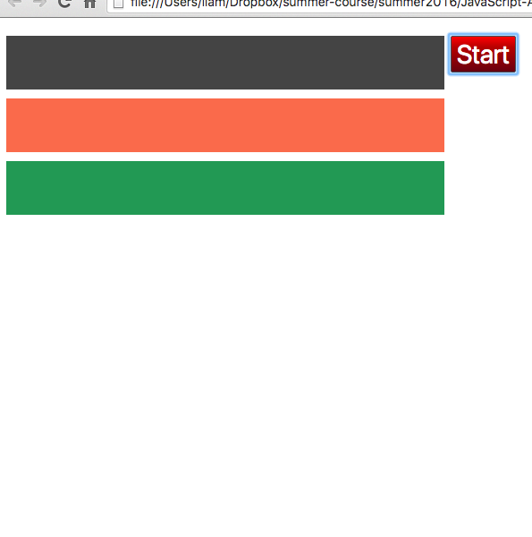

# Introduction to JavaScript (ECMAScript)

In 1995 JavaScript was developed and [created over 10 days](https://www.w3.org/community/webed/wiki/A_Short_History_of_JavaScript) for Netscape Navigator (a browser). In 1998 and 1999 ECMAScript (JavaScript) 2 and 3 were released. ECMAScript 4 was developed over 4 years then mothballed in 2003. ECMAScript 5 was finalized in 2009 and ECMAScript 6 was completed in June 2015. Desktop Chrome and Firefox both support ES6 (ECMAScript 6), while Safari and Intert Explorer lag behind.

In this class we'll write ES6 code and run it on Chrome v49 or greater.

## Falling Reddit Story Boxes... For Fun?

This workshop will introduce the following JavaScript, specifically ES6, topics:

1. Chrome debugger
2. `class`
3. Arrow Functions
4. Default Values
5. Promises

Then end goal is to create an app that can:

1. Instantiate 3 coloured `<div>`'s and add them to the `<body>`, then
2. Fetch the top Reddit stories and place the top 3 in one of the 3 `<div>`'s and then
3. Wait for 5 seconds and then
4. The 3 `<div>`'s fall to the bottom of the page!

### Start


### 3 coloured `<div>`'s (step 1.)


### 2. Reddit Stories (step 2.)


### Falling `<div>`'s (step 3.)


### Done


## Starting with `class`

At the top of animation.js create a new class:

```javascript
class FallingDiv {
  constructor() {
  	this.el = ...;
  }
  
  draw(top, color) {
  
  }
}

var fdiv = new FallingDiv();
```

The constructor will 1. create the `<div>` and 2. add a css class (`'box'`) to get `<div class="box">`. The `draw()` function will add the `<div>` to the `<body>`. Ignore the `top` and `color` parameters for now. The final line instantiates a new FallingDiv Object. 

Scroll down to see the cheat, or try and figure it out first (no `jQuery`, only 3 lines of code needed).

### Cheat

```javascript
class FallingDiv {
  constructor() {
    this.el = document.createElement('div');
    this.el.classList.add('box');
  }
  
  draw(top, color) {
    document.body.appendChild(this.el);
  }
}

var fdiv = new FallingDiv();
fdiv.draw();
```

### Adding `top` and `color`

At the moment your `<div>` is invisible and every `<div>` you add will appear in the exact same spot on the page. The `top` and `color` paramers will help fix those. When `draw()`'ing a new `FallingDiv` we'd like to be able to do:

```javascript
var fdiv = new FallingDiv();
fdiv.draw(20, '#444');
```

hint: to access the `<div>`'s css style you can do the following in your draw function `this.el.style.X = ...;` (where `X` is a css attribute).

### Cheat

```javascript
  draw(top, color) {
    this.offset = top; // save this value for later
    this.el.style.top = top + 'px';
    this.el.style.backgroundColor = color;
   
    document.body.appendChild(this.el);
  }
```

## Promises

Before going further we're going to quicly learn about promises which will provide some clues to the next steps. Let's say you wanted to create some code that prints to the console, waits 3 seconds, prints to the console and waits another 2 seconds then prints a 3rd time you might write your code like so:

```javascript
function delayedPrinting(){
  console.log('a');
  setTimeout(function(){
    console.log('b');
    setTimeout(function(){
      console.log('c');
    }, 1000 * 2);
  }, 1000 * 3);
}
```

`setTimeout(fn, milliseconds)` takes a callback function, `fn`, that it executes after `milliseconds`. Since we want the `console.log`'s to happen sequentially we have to nest the callback functions that we pass into `setTimeout`. Nested callbacks are difficult to read and make channing functions even more difficult. Promises provide a mechanism for cleaning up the above code and allowing for chaining. Let's see how they work.

```javascript
function consoleTimeout(text, waitTime){
  var deferred = Promise.defer();
  
  setTimeout(function(){
    console.log(text)
  	 deferred.resolve();
  }, waitTime);
  
  return deferred.promise;
}

console.log('a');
consoleTimeout('b', 1000*3);
```

Looking at the above example it looks more complicated to use promises. Before I show the advantange let's quickly look at what happens. `fnWithAPromise()` will return `deferred.promise` an object with a function called `.then()` attached to it. When the `setTimeout()` is completed, `deferred.resolve()` is called, with in turn calls the `.then()` function.

`setTimeout()` finishes => `deferred.resolve()` is called => `.then()` is called

The advantage comes when we chain the function like so (CLUE for solving this workshop btw!!):

```javascript
console.log('a');
consoleTimeout('b', 1000*3)
  .then(consoleTimeout('c', 1000*2));
```
It becomes trivially easy to keep on chaining more `.then()`'s and the readibility is maintained.

## Fetching Reddit Stories

Now that we have some idea of how to work with promises we can move onto fetching the top stories from Reddit. `animation.js` includes a function, `getTopRedditStories()` that will fetch the top 30 stories from Reddit - it returns a promise (just like `consoleTimeout()`). To fetch the stories you can do the following:

```javascript
getTopRedditStories()
  .then(function(stories){
  	 /* .... */
  });
```

`stories` is an array of story objects - you will have to use the debugger to determine where in the story object the title is. You'll have to take the first 3 stories and pass their title to each instance of `FallingDiv`, through a function we'll create next. The next step is to add a 3rd function to our `FallingDiv` class:

```javascript
  addStory(title){
    this.el.innerText = title;
  }
```

The above function takes the reddit story title then assigns it to our elements `innerText` property. If all goes well when you press the Start button you're boxes will appear and few seconds later they'll be populated with Reddit stories. 

## Waiting 5 Seconds

You should be able to complete this step based on the code in the section for Promises. To confirm that it works you can add a `console.log()` statement. A clue if your confused is that you'll be chaining the wait 3 second function with the `getTopRedditStories()`. 

### Cheat

```javascript
getTopRedditStories()
  .then(function(stories){
  	 /* .... */
  })
  .then(function(){
    console.log('waiting 3 seconds...');
    var deferred = Promise.defer();
    setTimeout(deferred.resolve, 1000*3);
    return deferred.promise;
   });
```

### Quick introduction to "arrow" functions

In the above cheat we're passing an annonymous callback function into each of the `.then()` functions. Using ES6's new arrow functions can make that type of code more concise:

```javascript
// old way
function(){

};

// new way
() => {

};
```

Using arrow functions:

```javascript
getTopRedditStories()
  .then((stories) => {
  	 /* .... */
  })
  .then(() => {
    console.log('waiting 3 seconds...');
    var deferred = Promise.defer();
    setTimeout(deferred.resolve, 1000*3);
    return deferred.promise;
   });
```

#### Advanced benefits of arrow function (to understand these two examples it works best to use the debugger to see that `this` is undefined in the first example): 

```javascript
/* this is a function in a class */
step(){
  setTimeout(function(){
    this.start() // this will be undefined, setTimeout is called in a different context
  }, 1000);
}

/* same function, but using arrow instead */
step(){
  setTimeout(() => {
    this.start() // this will work
  }, 1000);
}
```

## Animating the falling boxes!

To animate the boxes we'll add two functions to our `FallingDiv` class: `fall()` and `step()`. `fall()` will initialize a few variables necessary for the animation and then kick-off the animation by calling `step()`. `step()` will be called repeatedly until the `<div>` reatches the bottom. The 3 variables that will be initialized within `fall()`:

1. `this.MAX_DROP_HEIGHT` // the height of the window minus `this.el.clientHeight`
2. `this.fallingRate` // how many pixels box drops on each redraw
3. `this.distanceDropped` // total amount box has dropped, start with `this.offset`

After that call `this.step()` - which is another function you'll have to create. Instead of calling `this.step()` directly you'll use `window.requestAnimationFrame()` which takes a callback function, that it will call after the next page redraw. This is the most efficient way to do animations.

### `step()`

1. if `this.distanceDropped` is more than `this.MAX_DROP_HEIGHT` then do nothing, otherwise:
2. increment the `this.distanceDropped` variable by `this.fallingRate`.
3. assign `this.distanceDropped` to `this.el.style.top`. Note that `this.el.style.top` takes strings that end with `'px'` and `this.distanceDropped` is a number.
4. Recursive step! Use `window.requestAnimationFrame()` to call `this.step()`.

### Cheat

```javascript
  step(){
    if(this.distanceDropped <= this.MAX_DROP_HEIGHT){
      this.distanceDropped += this.fallingRate;
      this.el.style.top = this.distanceDropped + 'px';
      
      window.requestAnimationFrame(() => this.step());
    }
  }
  
  fall(){
    this.MAX_DROP_HEIGHT = window.innerHeight - this.el.clientHeight;
    this.fallingRate = 10;
    this.distanceDropped = this.offset;
    window.requestAnimationFrame(() => this.step());
  }
```

### final step

You'll now have to call `fdiv.fall()` for each of the 3 FallingDiv's in a `.then()` callback that happens directly after the 3 second callback.

## All the code - FULL CHEAT!

```javascript
class FallingDiv{
  constructor(){
    this.el = document.createElement('div');
    this.el.classList.add('box');
  }

  draw(offset, color){
    this.offset = offset;
    this.el.style.top = offset + 'px';
    this.el.style.backgroundColor = color;
    
    document.body.appendChild(this.el);
  }

  addStory(title){
    this.el.innerText = title;
  }

  step(){
    if(this.distanceDropped <= this.MAX_DROP_HEIGHT){
      this.distanceDropped += this.fallingRate;
      this.el.style.top = this.distanceDropped + 'px';
      
      window.requestAnimationFrame(() => this.step());
    }
  }

  fall(){
    this.MAX_DROP_HEIGHT = window.innerHeight - this.el.clientHeight;
    this.fallingRate = 10;
    this.distanceDropped = this.offset;
    window.requestAnimationFrame(() => this.step());
  }
}

function startSequence(){
  var fdiv1 = new FallingDiv();
  var fdiv2 = new FallingDiv();
  var fdiv3 = new FallingDiv();

  fdiv1.draw(20, '#444');
  fdiv2.draw(90, '#FA6A4B');
  fdiv3.draw(160, '#229954');

  getTopRedditStories()
    .then(function(res){
      console.log('stories loaded...');
      fdiv1.addStory(res[0].data.title);
      fdiv2.addStory(res[1].data.title);
      fdiv3.addStory(res[2].data.title);
    }, function(err){
      console.log(err)
    })
    .then(() => {
      console.log('waiting 5 seconds...');
      var deferred = Promise.defer();
      setTimeout(deferred.resolve, 1000*5);
      return deferred.promise;
    })
    .then(() => {
      console.log('elements will fall');
      fdiv1.fall();
      fdiv2.fall();
      fdiv3.fall();
    });
}
```